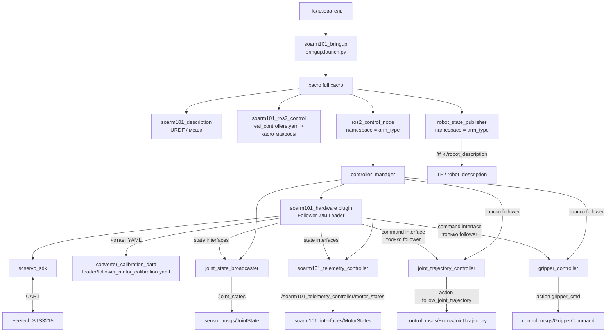
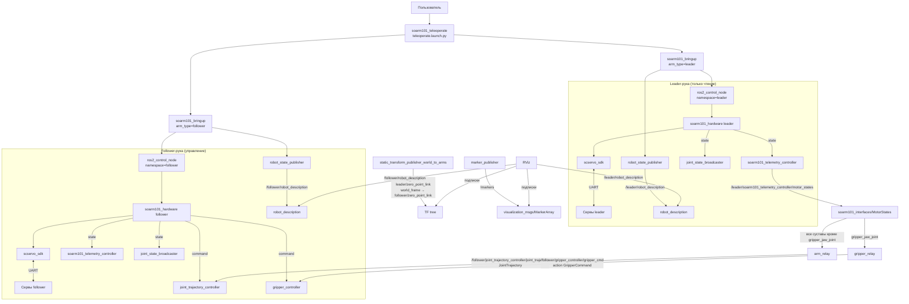

# SOARM101 ROS2 Workspace

Репозиторий содержит программный стек для взаимодействия с роботизированной рукой **SOARM101** в среде ROS2 Humble. Решение построено на базе фреймворка `ros2_control`, позволяет управлять физическими сервоприводами, интегрировано с MoveIt2 и предоставляет расширенную телеметрию. Для калибровки используются оригинальные калибровочные файлы lerobot и переводятся в кастомный формат.  

> **Документация двухуровневая:** в каждом пакете присутствует собственная документация, дополняющая этот общий README.


---

## Структура репозитория

| Пакет | Назначение |
|-------|------------|
| **`soarm101_interfaces`** | Кастомные сообщения для телеметрии моторов (`MotorState`, `MotorStates`). |
| **`soarm101_description`** | URDF-описание робота, геометрия, кинематика, визуализация (STL-меши). |
| **`soarm101_hardware`** | Аппаратный компонент `ros2_control` для управления сервоприводами через SDK. |
| **`soarm101_ros2_control`** | Конфигурационные файлы `ros2_control` (реальный робот и симуляция). |
| **`soarm101_telemetry_controller`** | Кастомный контроллер для публикации расширенной телеметрии (температура, напряжение, ток, флаг движения). |
| **`soarm101_moveit_config`** | Конфигурация MoveIt2 для планирования траекторий. |
| **`soarm101_bringup`** | Пакет-агрегатор для единого запуска всей системы (реальный робот или Gazebo). |
| **`soarm101_examples`** | Примеры узлов для управления суставами и схватом через action-интерфейсы. |
| **`converter_calibration_data`** | Инструмент для конвертации калибровочных данных из формата lerobot в кастомный YAML. |
| **`scservo_sdk`** | SDK для работы с сервоприводами Feetech (SCSCL, SMS_STS, HLSCL, SCS0009). |
| **`soarm101_teleoperate`** | Телеуправление follower-рукой с помощью leader-руки: relay-узлы, статические трансформации, маркеры. |

---

## Архитектура решения

Программный стек состоит из нескольких логических уровней. На диаграммах ниже показаны два основных сценария передачи данных.

### Одиночный запуск робота (soarm101_bringup)



**Важно:**  
Для `arm_type=leader` аппаратный плагин экспортирует только state-интерфейсы, поэтому контроллеры `joint_trajectory_controller` и `gripper_controller` не загружаются.

### Телеуправление (soarm101_teleoperate)



**Ключевые связи телеуправления:**
- Leader-рука публикует телеметрию в `/leader/soarm101_telemetry_controller/motor_states`.
- `arm_relay` подписывается на неё и публикует `JointTrajectory` в топик follower.
- `gripper_relay` отправляет команду схвату через action.
- Статические трансформации и маркеры позволяют RViz корректно отображать обе руки.

---

## Требования к системе

- **Операционная система**: Ubuntu 22.04 (рекомендуется)  
- **ROS2**: Humble (протестировано на Humble)  
- **Компилятор**: C++17, Python 3.8+  
- **Аппаратное обеспечение**: роборука SOARM101 (подключённая по USB/последовательному порту)  
- **Дополнительно**:  
  - Установленный python3-пакет `lerobot` (для калибровки) – см. [huggingface/lerobot](https://github.com/huggingface/lerobot)  
  - Для работы с MoveIt2: `moveit2`, `moveit_visual_tools` и др. (будут добавлены в зависимости позже)

---

## Процесс развёртывания и запуска

1. **Установите lerobot** (следуйте инструкциям официального репозитория) [Ссылка на инструкцию](https://huggingface.co/docs/lerobot/installation).  
2. **Включите робота** и подключите к компьютеру.  
3. **Проведите калибровку** согласно [официальлной инструкции lerobot](https://huggingface.co/docs/lerobot/so101?calibrate_leader=Command)
4. Создайте рабочее пространство и скачайте наш репозиторий.
   ```bash
   mkdir -p so-arm101-ros2-pkgs_ws/src
   cd so-arm101-ros2-pkgs_ws/src
   git clone https://github.com/cyberbanana777/so-arm101-ros2-pkgs.git .
   ```  
5. **Преобразуйте калибровочные данные** в нужный формат.  
   Для leader-руки:
   ```bash
   cd converter_calibration_data
   pip install -r pip_requirements.txt
   cd converter_calibration_data
   python3 lerobot_to_custom_format.py </global/path/to/lerobot_calib.json> ../config/motor_calibration.yaml leader
   ```
   Для follower-руки:
   ```bash
   python3 lerobot_to_custom_format.py </global/path/to/lerobot_calib.json> ../config/motor_calibration.yaml follower
   ```
6. **Создайте стабильные имена портов (udev-правила).**  
   Скрипт `create_udev_rule.sh` автоматически находит USB-устройства с VID:PID `1a86:55d3` (конвертер интерфейсов для взаимодействия с Feetech-сервоприводами), просит поочерёдно подключать их и назначить имена. На выходе создаётся файл `/etc/udev/rules.d/99-soarm-usb-serial.rules` с симлинками вида `/dev/soarm101_leader`, `/dev/soarm101_follower` и т.д.  
   Подробное описание скрипта — в разделе [Создание udev-правил](#создание-udev-правил).
   ```bash
   cd ../..
   chmod +x create_udev_rule.sh
   # имена симлинков должны быть soarm101_follower и soarm101_leader
   sudo ./create_usev_rule.sh
   ```

7. **Произведите настройку для реального времени ROS2_control**. Для этого необходимо перейти по ссылке и выполнить то, что описано в [гайде](https://control.ros.org/master/doc/ros2_control/controller_manager/doc/userdoc.html#:~:text=For%20real%2Dtime,and%20in%20again.)

8. **Соберите workspace** (из корня рабочей области):  
   ```bash 
   cd ..
   colcon build
   ```  
9a. **Если Вы хотите запустить 1 робота, то Запустите полный стек** через bringup:  
   ```bash
   source install/setup.bash
   ros2 launch soarm101_bringup bringup.launch.py use_sim:=false
   ```
   Для симуляции в Gazebo замените `use_sim:=false` на `use_sim:=true`.
9b. **Если Вы хотите запустить 2 роботов в режиме телеуправления**, то выполните команду:
   ```bash
   source install/setup.bash
   ros2 launch soarm101_teleoperate teleoperate.launch.py
   ```
   При необходимости укажите порты:
   ```bash
   ros2 launch soarm101_teleoperate teleoperate.launch.py \
     leader_port:=/dev/soarm101_leader \
     follower_port:=/dev/soarm101_follower
   ```
---

## Создание udev-правил

Скрипт `create_udev_rule.sh` предназначен для автоматической генерации udev-правил, обеспечивающих стабильные имена последовательных портов для сервоприводов SOARM101. Без этого при каждом подключении устройства могут получать разные имена `/dev/ttyACM*`, что приводит к ошибкам в конфигурации.

### Что делает скрипт

- Ищет все подключенные устройства с VID:PID `1a86:55d3` (Feetech-сервоприводы, используемые в SOARM101).  
- Просит пользователя отключить все устройства, затем подключать их по одному.  
- Для каждого нового устройства определяет серийный номер (`ID_SERIAL_SHORT`) и просит задать желаемое имя (например, `soarm101_leader`).  
- Генерирует файл `/etc/udev/rules.d/99-soarm-usb-serial.rules` с правилами:  
  ```
  SUBSYSTEM=="tty", ATTRS{idVendor}=="1a86", ATTRS{idProduct}=="55d3", ATTRS{serial}=="<серийный номер>", SYMLINK+="<имя>", MODE="0666"
  ```
- Перезагружает udev-правила и активирует их.  
- Выводит список созданных симлинков и их целевые устройства.

### Использование

```bash
sudo ./create_udev_rule.sh
```

Скрипт запускается с правами root и работает интерактивно:

1. Убедитесь, что все целевые устройства отключены, нажмите Enter.  
2. Поочерёдно подключайте устройства и для каждого вводите имя (или оставьте пустым, чтобы использовать серийный номер).  
3. После добавления всех устройств введите `done`.  
4. Скрипт создаст правила, применит их и покажет итоговые симлинки.

**Важно:** в нашем стеке используются два устройства: leader и follower. Рекомендуется задавать имена `soarm101_leader` и `soarm101_follower` соответственно, чтобы launch-файлы могли найти порты по умолчанию.

---

## Внешние интерфейсы стека (Public API)

После запуска системы внешние пользователи и узлы могут взаимодействовать с роботом через следующие ROS2-интерфейсы.

### Одиночная рука (bringup)

**Топики (Topics):**
- `/joint_states` (`sensor_msgs/msg/JointState`) — текущие положения, скорости и усилия всех сочленений.  
  В телеоперационном режиме дополнительно доступны:  
  - `/leader/joint_states`  
  - `/follower/joint_states`
- `/robot_description` (`std_msgs/msg/String`) — описание робота.  
  В телеоперационном режиме дополнительно доступны:  
  - `/leader/robot_description`  
  - `/follower/robot_description`
- `/soarm101_telemetry_controller/motor_states` (`soarm101_interfaces/msg/MotorStates`) — расширенные данные телеметрии: температура сервоприводов, напряжение, ток, флаги движения и ошибок.
- `/tf` — трансформации между звеньями робота (для визуализации в RViz и навигации).

**Действия (Actions):**
- `/joint_trajectory_controller/follow_joint_trajectory` (стандартный action из `control_msgs`) — основной интерфейс для выполнения траекторий (используется MoveIt2 и примерами).
- `/gripper_controller/gripper_cmd` (`control_msgs/action/GripperCommand`) — управление схватом.

### Телеуправление (`soarm101_teleoperate`)

**Топики (Topics):**
- `/leader/soarm101_telemetry_controller/motor_states` (`soarm101_interfaces/msg/MotorStates`) — телеметрия leader-руки, источник для ретрансляции.
- `/follower/joint_trajectory_controller/joint_trajectory` (`trajectory_msgs/msg/JointTrajectory`) — команды для follower-руки, формируемые relay-узлом.
- `/markers` (`visualization_msgs/msg/MarkerArray`) — маркеры для визуальной идентификации рук в RViz.

**Действия (Actions):**
- `/follower/gripper_controller/gripper_cmd` (`control_msgs/action/GripperCommand`) — команда схвату follower-руки от relay-узла.

**Статические трансформации:**
- `world_frame` → `leader/zero_point_link`
- `world_frame` → `follower/zero_point_link`

> **Примечание:** точные названия топиков и типов сообщений могут уточняться в документации к соответствующим пакетам.

---

## Ссылки на источники и заимствования

- **lerobot** – оригинальная библиотека для калибровки и управления роботами: https://github.com/huggingface/lerobot

- **SC-SERVO SDK** – адаптирован из репозитория [adityakamath/SCServo_Linux](https://github.com/adityakamath/SCServo_Linux)

- **MoveIt2** – фреймворк для планирования движений: https://moveit.ai/

- **TheRobotStudio/SO-ARM100** – оригинальный URDF и меши: https://github.com/TheRobotStudio/SO-ARM100

---

## Лицензия

Распространяется под лицензией **MIT** (см. [LICENSE](LICENSE) в корне репозитория) (если не указано иное в отдельных пакетах).

---

## Контакты и поддержка

- Вопросы и предложения оформляйте через [Issues](https://github.com/cyberbanana777/so-arm101-ros2-pkgs/issues).  

---


## Полезные ссылки

- Приложение для отладки Feetech-сервоприводов (Qt): [FT_SCServo_Debug_Qt](https://github.com/Kotakku/FT_SCServo_Debug_Qt)