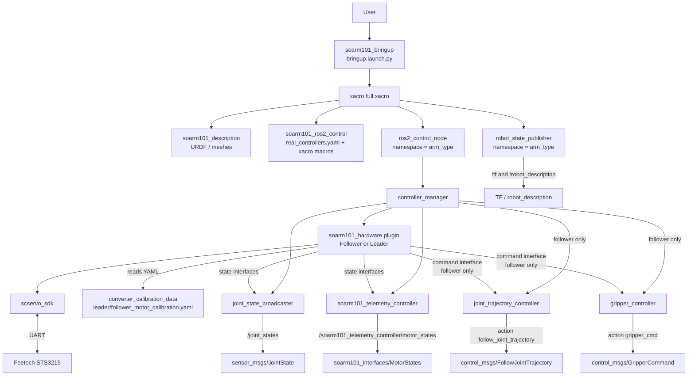
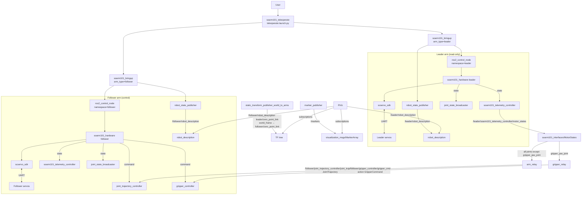

# SOARM101 ROS2 Workspace

The repository contains a software stack for interacting with the **SOARM101** robotic arm in the ROS2 Humble environment. The solution is built on top of the `ros2_control` framework, supports controlling physical servo motors, integrates with MoveIt2, and provides extended telemetry. It also implements teleoperation of the follower manipulator using the leader manipulator. For calibration, the original lerobot calibration files are used and converted into a custom format.

> **Two-level documentation:** each package has its own documentation that complements this general README.

---

## Repository structure

| Package | Purpose |
|---------|---------|
| **`soarm101_interfaces`** | Custom messages for motor telemetry (`MotorState`, `MotorStates`). |
| **`soarm101_description`** | Robot URDF description, geometry, kinematics, visualization (STL meshes). |
| **`soarm101_hardware`** | `ros2_control` hardware component for controlling servos via the SDK. |
| **`soarm101_ros2_control`** | `ros2_control` configuration files (real robot and simulation). |
| **`soarm101_telemetry_controller`** | Custom controller for publishing extended telemetry (temperature, voltage, current, motion flag). |
| **`soarm101_moveit_config`** | MoveIt2 configuration for trajectory planning. |
| **`soarm101_bringup`** | Aggregator package for unified system launch (real robot or Gazebo simulation). |
| **`soarm101_examples`** | Example nodes for controlling joints and gripper via action interfaces. |
| **`converter_calibration_data`** | Tool for converting calibration data from the lerobot format to custom YAML. |
| **`scservo_sdk`** | SDK for working with Feetech servos (SCSCL, SMS_STS, HLSCL, SCS0009). |
| **`soarm101_teleoperate`** | Teleoperation of the follower arm using the leader arm: relay nodes, static transforms, markers. |

---

## System requirements

- **Operating system**: Ubuntu 22.04 (recommended)  
- **ROS2**: Humble (tested on Humble)  
- **Compiler**: C++17, Python 3.8+  
- **Hardware**: SOARM101 robotic arm (connected via USB/serial port)  
- **Software**:
  - Installed `lerobot` Python package (for calibration) – see [huggingface/lerobot](https://github.com/huggingface/lerobot)  
  - For MoveIt2: `moveit2`, `moveit_visual_tools`, etc. (will be added to dependencies later)

---

## Deployment and launch process

1. **Install lerobot** (follow the instructions in the official repository) [Installation link](https://huggingface.co/docs/lerobot/installation).  
2. **Turn on the robot** and connect it to the computer.  
3. **Perform calibration** according to the [official lerobot instructions](https://huggingface.co/docs/lerobot/so101?calibrate_leader=Command).  
4. Create a workspace and clone our repository:
   ```bash
   mkdir -p so-arm101-ros2-pkgs_ws/src
   cd so-arm101-ros2-pkgs_ws/src
   git clone https://github.com/cyberbanana777/so-arm101-ros2-pkgs.git .
   ```  
5. **Convert the calibration data** to the required format.  
   For the leader arm:
   ```bash
   cd converter_calibration_data
   pip install -r pip_requirements.txt
   cd converter_calibration_data
   python3 lerobot_to_custom_format.py </global/path/to/lerobot_calib.json> ../config/motor_calibration.yaml leader
   ```
   For the follower arm:
   ```bash
   python3 lerobot_to_custom_format.py </global/path/to/lerobot_calib.json> ../config/motor_calibration.yaml follower
   ```
6. **Create stable port names (udev rules).**  
   The `create_udev_rule.sh` script automatically finds USB devices with VID:PID `1a86:55d3` (an interface converter for communicating with Feetech servos), asks you to connect them one by one, and assign names. As a result, it creates `/etc/udev/rules.d/99-soarm-usb-serial.rules` with symlinks like `/dev/soarm101_leader`, `/dev/soarm101_follower`, etc.  
   A detailed description of the script is in the [Creating udev rules](#creating-udev-rules) section.
   ```bash
   cd ../..
   chmod +x create_udev_rule.sh
   # symlink names should be soarm101_follower and soarm101_leader
   sudo ./create_udev_rule.sh
   ```

7. **Configure real-time settings for ROS2_control.** Follow the [guide](https://control.ros.org/master/doc/ros2_control/controller_manager/doc/userdoc.html#:~:text=For%20real%2Dtime,and%20in%20again).

8. **Build the workspace** (from the workspace root):
   ```bash
   cd ..
   colcon build
   ```  
9a. **If you want to launch one robot**, start the full stack via bringup:
   ```bash
   source install/setup.bash
   ros2 launch soarm101_bringup bringup.launch.py use_sim:=false
   ```
   For Gazebo simulation, replace `use_sim:=false` with `use_sim:=true`.

9b. **If you want to launch two robots in teleoperation mode**, run:
   ```bash
   source install/setup.bash
   ros2 launch soarm101_teleoperate teleoperate.launch.py
   ```
   If necessary, specify the ports:
   ```bash
   ros2 launch soarm101_teleoperate teleoperate.launch.py \
     leader_port:=/dev/soarm101_leader \
     follower_port:=/dev/soarm101_follower
   ```
---

## Creating udev rules

The `create_udev_rule.sh` script is designed for automatic generation of udev rules that provide stable serial port names for SOARM101 servos. Without this, devices may receive different names `/dev/ttyACM*` on each connection, which leads to configuration errors.

### What the script does

- Finds all connected devices with VID:PID `1a86:55d3` (the Feetech servos used in SOARM101).  
- Asks the user to disconnect all devices, then connect them one by one.  
- For each new device, determines the serial number (`ID_SERIAL_SHORT`) and asks for a desired name (for example, `soarm101_leader`).  
- Generates `/etc/udev/rules.d/99-soarm-usb-serial.rules` with rules like:
  ```
  SUBSYSTEM=="tty", ATTRS{idVendor}=="1a86", ATTRS{idProduct}=="55d3", ATTRS{serial}=="<serial number>", SYMLINK+="<name>", MODE="0666"
  ```
- Reloads and activates the udev rules.  
- Prints the list of created symlinks and their target devices.

### Usage

```bash
sudo ./create_udev_rule.sh
```

The script is run with root privileges and works interactively:

1. Make sure all target devices are disconnected, then press Enter.  
2. Connect devices one by one and enter a name for each one (or leave it empty to use the serial number).  
3. After all devices have been added, enter `done`.  
4. The script will create the rules, apply them, and show the resulting symlinks.

**Important:** our stack uses two devices: leader and follower. It is recommended to assign the names `soarm101_leader` and `soarm101_follower`, respectively, so that launch files can find the default ports.

---

## External stack interfaces (Public API)

After the system starts, external users and nodes can interact with the robot and obtain information through the following ROS2 interfaces.

### Single arm (bringup)

**Topics:**
- `/joint_states` (`sensor_msgs/msg/JointState`) — current positions, velocities, and efforts of all joints.  
  In teleoperation mode, the following are additionally available:  
  - `/leader/joint_states`  
  - `/follower/joint_states`
- `/robot_description` (`std_msgs/msg/String`) — robot description.  
  In teleoperation mode, the following are additionally available:  
  - `/leader/robot_description`  
  - `/follower/robot_description`
- `/soarm101_telemetry_controller/motor_states` (`soarm101_interfaces/msg/MotorStates`) — extended telemetry data: servo temperature, voltage, current, motion and error flags.
- `/tf` — transforms between robot links (for visualization in RViz and navigation).

**Actions:**
- `/joint_trajectory_controller/follow_joint_trajectory` (a standard `control_msgs` action) — the main interface for trajectory execution (used by MoveIt2 and examples).
- `/gripper_controller/gripper_cmd` (`control_msgs/action/GripperCommand`) — gripper control.

### Teleoperation (`soarm101_teleoperate`)

**Topics:**
- `/leader/soarm101_telemetry_controller/motor_states` (`soarm101_interfaces/msg/MotorStates`) — leader arm telemetry, the source for relaying.
- `/follower/joint_trajectory_controller/joint_trajectory` (`trajectory_msgs/msg/JointTrajectory`) — commands for the follower arm generated by the relay node.
- `/markers` (`visualization_msgs/msg/MarkerArray`) — markers for visually identifying the arms in RViz.

**Actions:**
- `/follower/gripper_controller/gripper_cmd` (`control_msgs/action/GripperCommand`) — gripper command sent to the follower arm by the relay node.

**Static transforms:**
- `world_frame` → `leader/zero_point_link`
- `world_frame` → `follower/zero_point_link`

> **Note:** exact topic names and message types may be clarified in the documentation of the corresponding packages.

---

## Solution architecture

The software stack consists of several logical layers. The diagrams below show two main data flow scenarios.

### Single robot launch (soarm101_bringup)



**Important:**  
For `arm_type=leader`, the hardware plugin exports only state interfaces, so the `joint_trajectory_controller` and `gripper_controller` controllers are not loaded.

### Teleoperation (soarm101_teleoperate)



**Key teleoperation links:**
- The leader arm publishes telemetry to `/leader/soarm101_telemetry_controller/motor_states`.
- `arm_relay` subscribes to it and publishes `JointTrajectory` to the follower topic.
- `gripper_relay` sends a gripper command via an action.
- Static transforms and markers allow RViz to correctly display both arms.

---

## Sources and acknowledgements

- **lerobot** – original library for robot calibration and control: https://github.com/huggingface/lerobot

- **SC-SERVO SDK** – adapted from the [adityakamath/SCServo_Linux](https://github.com/adityakamath/SCServo_Linux) repository

- **MoveIt2** – motion planning framework: https://moveit.ai/

- **TheRobotStudio/SO-ARM100** – original URDF and meshes: https://github.com/TheRobotStudio/SO-ARM100

---

## License

Distributed under the **MIT** license (see [LICENSE](LICENSE) in the repository root), unless otherwise stated in individual packages.

---

## Contacts and support

- Questions and suggestions should be submitted via [Issues](https://github.com/cyberbanana777/so-arm101-ros2-pkgs/issues).

---

## Useful links

- Feetech servo debugging application (Qt): [FT_SCServo_Debug_Qt](https://github.com/Kotakku/FT_SCServo_Debug_Qt)